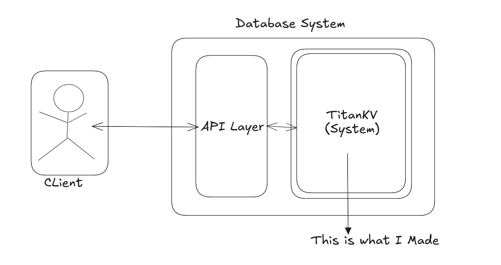
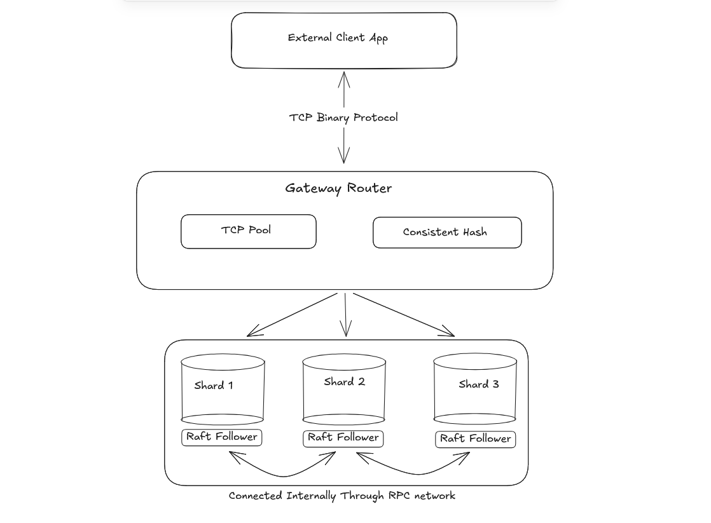
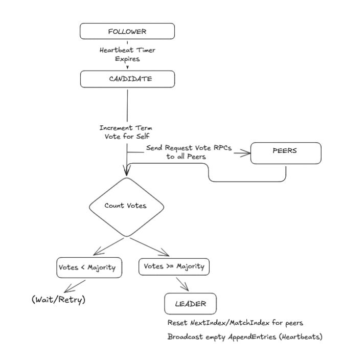
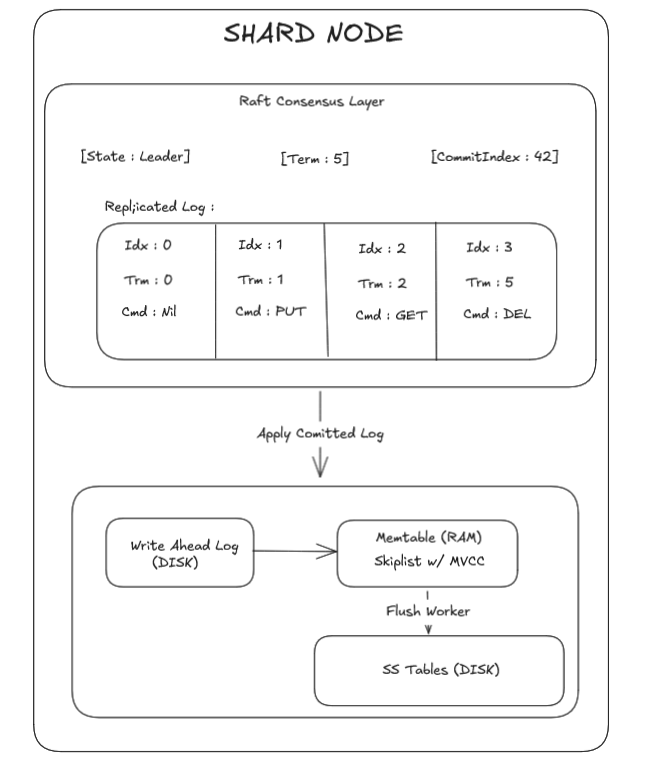
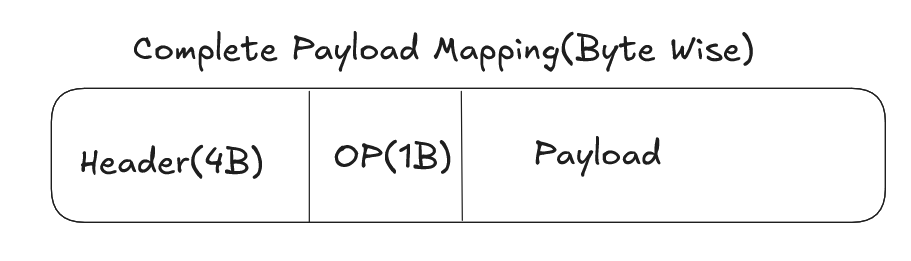

TitanKV is a strongly consistent distributed key-value database inspired by Google's LevelDB. While LevelDB is implemented in C++, TitanKV is built entirely in Go with the goal of accelerating development while exploring modern distributed database internals.

The project began as an educational deep dive into storage engines and gradually evolved into a distributed system featuring durability, replication, fault tolerance, and multi-version concurrency control(simply, time travel queries).

## What did i make

## Features

### Storage Engine

* Log-Structured Merge Tree (LSM Tree) architecture
* In-memory MemTable implemented using a Skip List
* Immutable SSTables for persistent storage
* Background flushing and compaction(extremely tough to write)
* Efficient write-heavy workload handling

### Durability & Recovery

* Write-Ahead Logging (WAL) for crash recovery
* Checksum-based corruption detection
* Automatic recovery after unexpected shutdowns
* Manifest-based SSTable tracking

### Multi-Version Concurrency Control (MVCC)

TitanKV supports versioned records through sequence-number-based MVCC.

This enables:

* Historical reads
* Time-travel queries
* Consistent snapshot semantics
* Multiple versions of the same key

Example:

```text
PUT(user, Alice)
PUT(user, Bob)

GetAt(user, old_seq) -> Alice
GetAt(user, latest)  -> Bob
```

### Distributed Architecture



TitanKV scales horizontally through sharding and distributed consensus.

Features include:

* Consistent Hashing based shard routing
* Virtual Nodes for balanced distribution
* TCP-based inter-node communication
* Connection pooling between nodes
* Automatic request routing through a gateway layer

### Strong Consistency

TitanKV uses the Raft Consensus Algorithm to achieve strong consistency across replicas.

Raft provides:

* Leader election
* Log replication
* Majority quorum commits
* Fault tolerance
* Automatic leader failover


A write is acknowledged only after it has been safely replicated to a majority of nodes.

### Performance-Oriented Design

* Skip List MemTable
* Sequential WAL writes
* SSTable-based immutable storage
* Connection pooling
* Lock-efficient concurrent operations
* Reduced garbage collection overhead through buffer reuse




---


TitanKV was built to explore how modern databases combine:

* LSM Trees
* MVCC
* Write-Ahead Logging
* Distributed Consensus
* Sharding
* Strong Consistency

into a single storage system.

The project prioritizes correctness and architectural clarity while remaining performant enough to handle large concurrent workloads.

---

## References & Research

The implementation is heavily inspired by the following papers and resources:

### Storage Engine

* LevelDB : Blogs about this project
* LSM Tree concepts from *Designing Data-Intensive Applications* (Chapter 3)
* Storage Engine design from *Designing Data-Intensive Applications* (Chapter 3)

### Consensus & Distributed Systems

* In Search of an Understandable Consensus Algorithm (Raft)
* Consistency models from *Designing Data-Intensive Applications : Chapter 1 & 3(a very small section)*

### Data Structures

* Skip List research by William Pugh

### Durability

* Write-Ahead Logging concepts from *Database System Concepts* by Henry F. Korth

